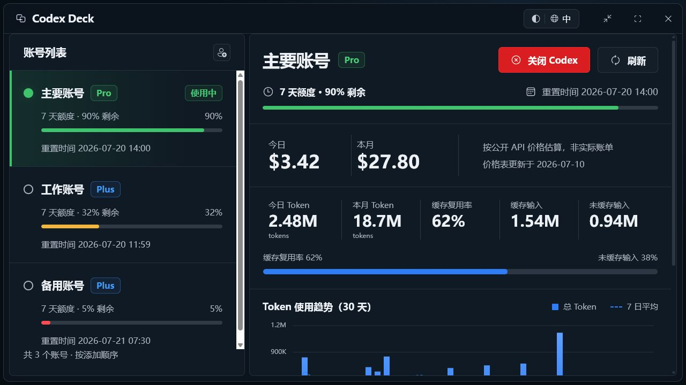
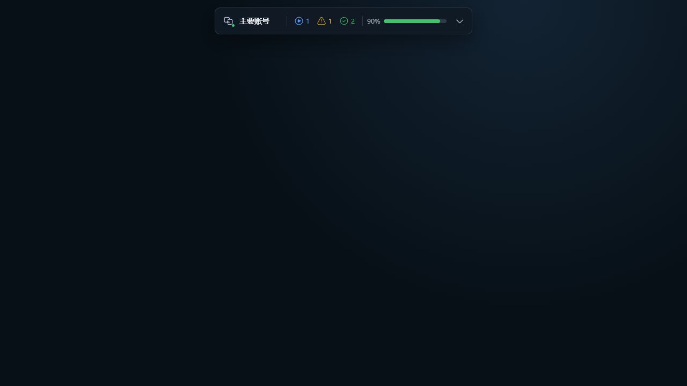

# Codex Deck

[](https://github.com/IReneZL/codex-deck/actions/workflows/ci.yml)
[](https://github.com/IReneZL/codex-deck/releases)
[](LICENSE)

轻量、Windows 优先的 Codex 多账号与用量控制台。Codex Deck 将账号切换、七天额度、Token 与缓存统计，以及置顶状态栏放在一个本地桌面应用中。

A lightweight, Windows-first local companion for switching between Codex accounts, checking quota and token usage, and keeping a compact always-on-top status bar.

> [!IMPORTANT]
> Codex Deck is an independent community project. It is not affiliated with, endorsed by, or supported by OpenAI. ChatGPT and Codex are trademarks of their respective owners.



## 功能 / Features

- 多账号独立登录和本地别名；当前账号置顶，其余账号按添加顺序排列。
- 七天额度与重置时间；额度窗口由返回数据决定，不硬编码五小时限制。
- 当日与当月 Token、缓存复用率、缓存/非缓存输入，以及按公开 API 价格估算的等价费用。
- 约 480 px 的置顶状态栏，显示当前账号、Codex 运行状态和额度。
- 中英文与明暗主题，保留窗口位置、尺寸和关闭行为。
- 账号凭据通过 Windows DPAPI 加密保存；多账号用量刷新不会把明文凭据写入临时文件。

English summary: isolated account sign-in, quota and usage dashboards, API-equivalent cost estimates, a compact status bar, bilingual light/dark UI, persisted window preferences, and Windows DPAPI-protected managed credentials.



## 下载 / Download

从 [GitHub Releases](https://github.com/IReneZL/codex-deck/releases) 下载最新的 Windows 安装包。首次发布的安装包可能尚未进行商业代码签名，因此 Windows SmartScreen 可能显示发布者警告；请只从本仓库的 Releases 页面下载，并核对版本说明中的 SHA-256。

Download the latest Windows installer from GitHub Releases. Early builds may be unsigned and can trigger a Windows SmartScreen publisher warning. Only download from this repository's Releases page and verify the SHA-256 listed in the release notes.

## 隐私与安全 / Privacy and security

- Codex Deck 不会把账号、Token 或用量数据上传到项目维护者的服务器。
- 已管理账号保存在 `%APPDATA%\Codex Deck\accounts.json`，该文件不在源码仓库内，凭据字段使用当前 Windows 用户的 DPAPI 加密。
- 当前 Codex 会话仍由官方 Codex 客户端管理；Codex Deck 只在本机调用相关服务。
- 用量接口属于尽力而为的内部集成，OpenAI 变更接口后可能暂时不可用。
- API 等价费用只是基于公开单价和本地模型混合的估算，不是订阅账单。

Codex Deck does not send accounts, tokens, or usage data to a maintainer-operated service. Managed credentials stay on the local machine and are DPAPI-encrypted at rest. See [SECURITY.md](SECURITY.md) for reporting instructions.

## 本地构建 / Build locally

Requirements:

- Windows 10/11
- Node.js 20+
- Rust toolchain compatible with Rust 1.77.2+
- Microsoft Edge WebView2 Runtime
- Official Codex desktop/CLI login for live data

```powershell
npm ci
npm test
npm run desktop:build
```

The NSIS installer is generated under `src-tauri/target/release/bundle/nsis/`.

## 项目状态 / Project status

Codex Deck is early-stage software. The internal usage endpoint and local Codex task format are not stable public APIs, so a Codex update can require a matching Codex Deck update. Back up important work before switching accounts because switching may require closing running Codex processes.

## Contributing

Bug reports and focused pull requests are welcome. Please read [CONTRIBUTING.md](CONTRIBUTING.md). Security reports should follow [SECURITY.md](SECURITY.md), not a public issue.

## License

[MIT](LICENSE)
